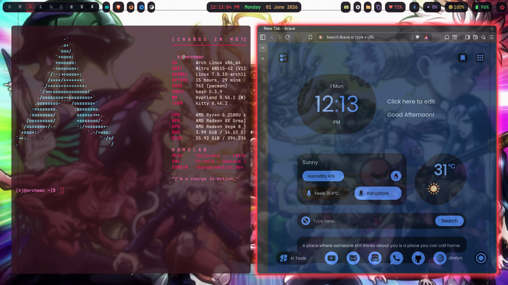
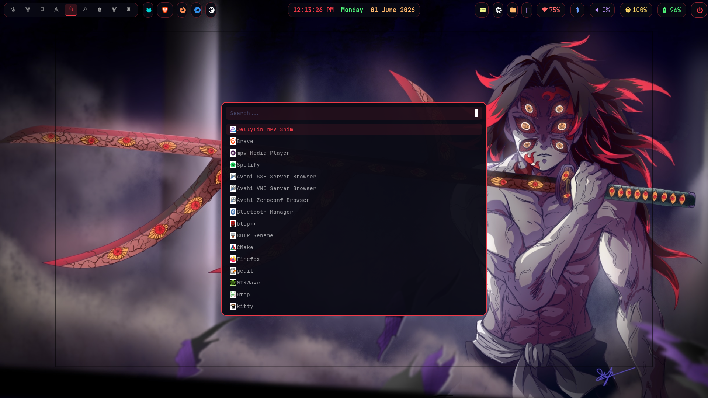
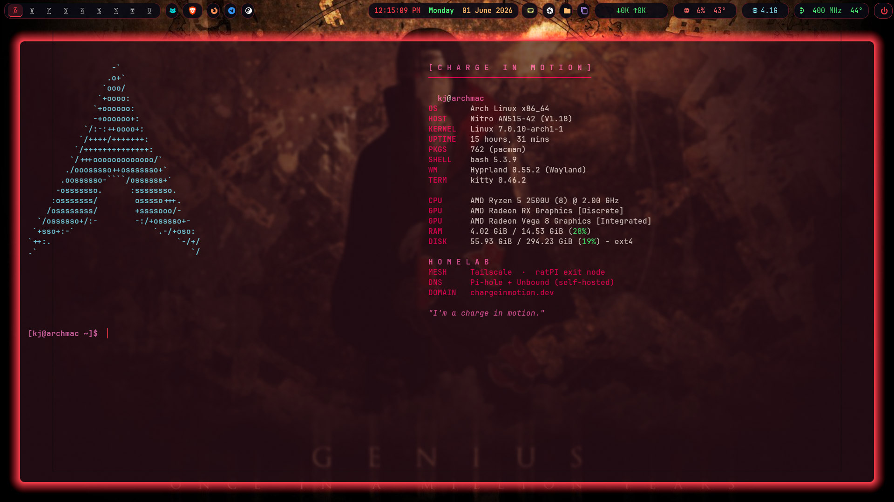

# archKJ-hypr-config

> A cyberpunk **Hyprland** rice for Arch Linux — clone, run one script, reboot into it.


Full Wayland desktop config plus the scripts and systemd units that drive it.
Multi-host aware — the same configs run on my Acer Nitro laptop (`archmac`) and
the older `archKJ` workstation. *Speak friend and enter: `bash install.sh`.*

---

## Screenshots

**Desktop** — Hyprland + Waybar, cyberpunk red/pink over an anime wallpaper.



| Rofi launcher | Terminal — Kitty + fastfetch banner |
|---------------|-------------------------------------|
|  |  |

> _More coming: Waybar close-up, Hyprlock, and the SDDM login screen._

---

## Why I Built This

I wanted a desktop that was entirely mine — every keybind, color, and module
deliberate, and reproducible on a fresh install in minutes. Daily-driving it
forces it to stay practical, not just pretty.

---

## System

| | |
|---|---|
| **Host** | Acer Nitro AN515-42 (`archmac`) — also runs on `archKJ` |
| **CPU / GPU** | AMD Ryzen + Radeon Vega iGPU |
| **WM** | Hyprland (Wayland) |
| **Bar** | Waybar (per-monitor) |
| **Launcher** | Rofi (cyberpunk theme) |
| **Terminal** | Kitty + JetBrainsMono Nerd Font |
| **Banner** | fastfetch — auto-sized Arch logo + system + homelab on shell open |
| **Lock** | Hyprlock + Hypridle |
| **Login** | SDDM (astronaut) + Sekiro GRUB theme |
| **Shell** | Bash |

**Theme:** background `#32111C`, accent `#EF3946`.

---

## Install

```bash
git clone https://github.com/SaroshGabriel/archKJ-hypr-config.git
cd archKJ-hypr-config
bash install.sh
```

Installs packages, symlinks configs, enables services, backs up anything it
would overwrite. Package lists: `docs/pacman-packages.txt`, `docs/aur-packages.txt`.
After install, reboot and pick **Hyprland** at SDDM. NTFS drives: see
`docs/HDD_MOUNT.md`.

---

## Keybindings

`SUPER` is the mod key.

### Applications
| Key | Action |
|-----|--------|
| `SUPER + Return` / `SUPER + K` | Kitty terminal |
| `SUPER + D` | Rofi app launcher |
| `SUPER + B` / `SUPER + F` | Brave / Firefox |
| `SUPER + T` | Thunar file manager |
| `SUPER + C` | VS Code |
| `SUPER + G` | Telegram |
| `SUPER + M` | cava (floating audio visualiser) |
| `SUPER + V` | Clipboard history (cliphist + Rofi) |

### Window management
| Key | Action |
|-----|--------|
| `SUPER + Q` | Close window |
| `SUPER + Space` | Toggle floating |
| `SUPER SHIFT + F` | Fullscreen |
| `SUPER + ←/→/↑/↓` | Move focus |
| `SUPER SHIFT + ←/→/↑/↓` | Move window |
| `SUPER CTRL + ←/→/↑/↓` | Resize window |
| `ALT + Tab` | Cycle windows |
| `SUPER + 1–9` | Switch workspace |
| `SUPER SHIFT + 1–9` | Send window to workspace |
| `SUPER + P` | Focus next monitor |

### System
| Key | Action |
|-----|--------|
| `SUPER + W` | Restart Waybar |
| `Print` | Screenshot region → clipboard |
| `SHIFT + Print` | Screenshot full output |
| `CTRL + Print` | Screenshot active window |
| `XF86Audio*` | Volume / mute / play-pause (wpctl + playerctl) |
| `XF86MonBrightness*` | Brightness (brightnessctl) |

---

## Layout

```
install.sh             Bootstrap: packages + symlinks + services
collect.sh             Pull live configs back into the repo
setup-github.sh        Git/SSH setup helper
configs/
  bashrc               Shell config (aliases auto-sync to running services)
  hypr/                hyprland.conf, hypridle, hyprland-portals
    scripts/           wallpaper, lid, monitor-hotplug, pre-timeshift-verify, fix-brave
  hyprlock/            Lock screen
  fastfetch/           Startup banner (config.jsonc + launch.sh, window-aware logo)
  kitty/  rofi/        Terminal + launcher (wifi / bluetooth / power menus)
  waybar/              config.jsonc, style.css, module scripts (cpu/gpu/battery/netspeed/...)
  sddm/  grub/         Login + boot themes
  systemd-system/      thermal-guardian, sddm-wallpaper units
  systemd-user/        disk-alert timer/service
docs/                  HDD_MOUNT.md, pacman/aur package lists
wallpapers/            124 wallpapers
```

---

## Scripts

| Script | Purpose |
|--------|---------|
| `configs/waybar/gpu.sh` | iGPU usage — auto-detects via active eDP output, no hard-coded PCI slot |
| `configs/waybar/netspeed.sh` | Live up/down network speed |
| `configs/hypr/scripts/monitor-hotplug.sh` | React to monitors being plugged/unplugged |
| `configs/hypr/scripts/lid.sh` | Laptop lid open/close handling |
| `configs/hypr/scripts/pre-timeshift-verify.py` | Sanity checks before a Timeshift snapshot |
| `scripts/thermal-guardian.sh` | Thermal watchdog (systemd service) |
| `scripts/disk-alert.sh` | Disk-usage threshold alerts (systemd timer) |
| `scripts/system/sddm-random-wallpaper.sh` | Randomise the SDDM login wallpaper |
| `configs/fastfetch/launch.sh` | Sizes the fastfetch Arch logo to the current terminal window |

---

## Notes

- **Hardware auto-detect:** `gpu.sh` finds the iGPU via the active eDP output, so
  the same config works across machines without editing PCI slots.
- **Hypridle** staggers lock/DPMS and suspends at 30 min.
- ProtonVPN / credentials are **not** stored in this repo.
- **~1 GB repo — it's the wallpapers.** Configs-only checkout:
  ```bash
  git clone --filter=blob:none --sparse https://github.com/SaroshGabriel/archKJ-hypr-config.git
  cd archKJ-hypr-config && git sparse-checkout set configs scripts docs
  ```

---

## Branches

- **`main`** — primary, machine-agnostic configs.
- **`archmac`** — Acer Nitro laptop tweaks (per-monitor bars, brightness module, slim autostart).

---

## Roadmap

- [ ] Add screenshots
- [ ] Move wallpapers out of git (LFS or separate release) to shrink clones
- [ ] One-shot dotfiles bootstrap on a truly fresh install, start to finish

---

## Credits

This rice began as a clone of **[HighCarlSagan/m-hypr-config](https://github.com/HighCarlSagan/m-hypr-config)**
right after my first Arch install, then grew into its own thing as I rebuilt and
retuned it for my machines. Huge thanks to [Carl](https://github.com/HighCarlSagan)
for the starting point and the inspiration.

---

## Author

**Sarosh (KJ)** · [github.com/SaroshGabriel](https://github.com/SaroshGabriel) · saroshjibreel@gmail.com
